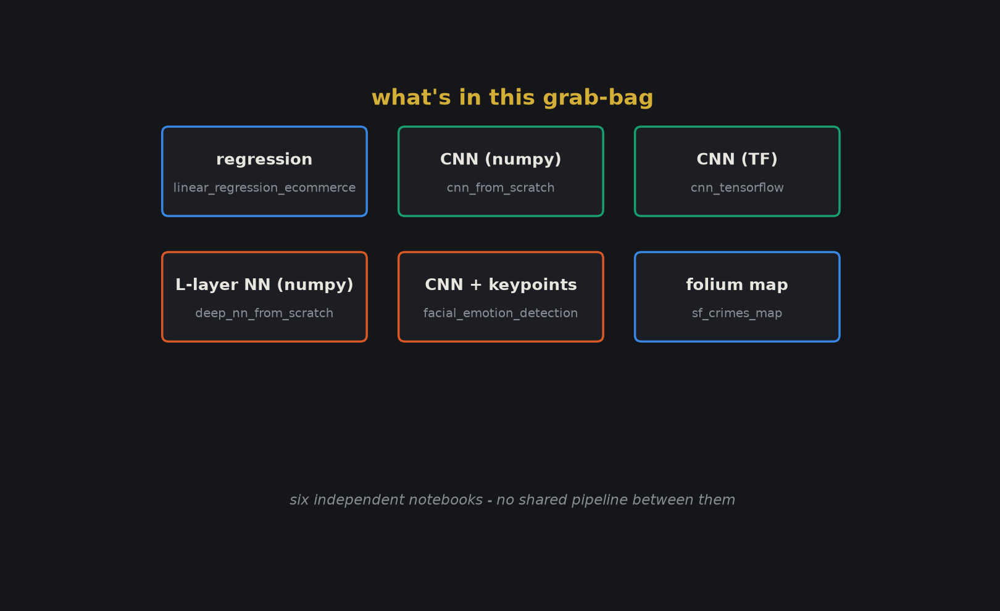
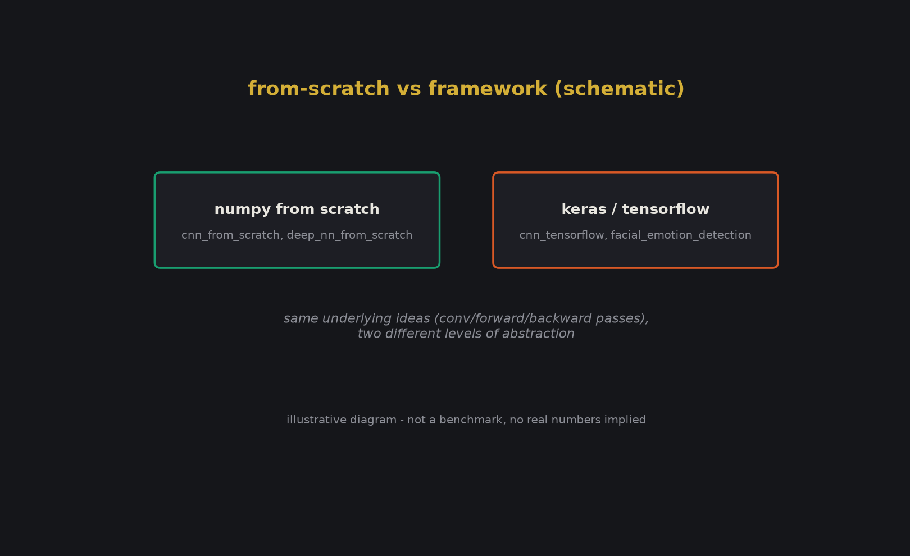
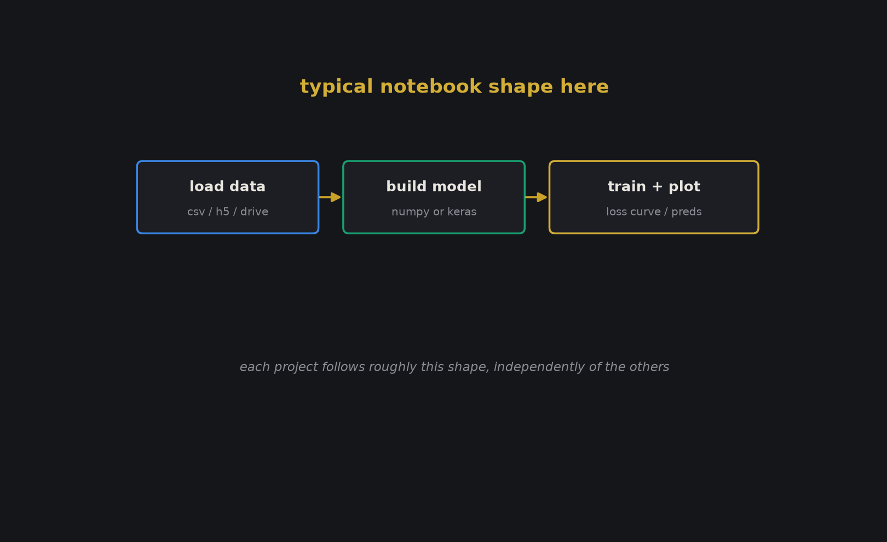

# Machine_learning_projects

A grab-bag of six standalone notebooks from when I was working through ML/DL
fundamentals - some from scratch in numpy, some in Keras/TensorFlow, one just
a data-viz exercise. They don't share code or a pipeline, so I've split each
into its own folder rather than pretending this is one coherent project.

## what's here

- `linear_regression_ecommerce/` - basic linear regression on a fake
  Ecommerce dataset (does time-on-app/time-on-website predict yearly spend).
- `cnn_from_scratch/` - a convolutional net implemented with raw numpy
  (conv forward pass, pooling, the works) - no Keras/TF involved.
- `cnn_tensorflow/` - the same kind of CNN, this time built with TensorFlow.
- `deep_nn_from_scratch/` - an L-layer fully-connected network, also numpy
  only, for the classic "cat vs non-cat" image classification toy problem.
- `facial_emotion_detection/` - a Colab notebook that trains a CNN (with a
  DenseNet backbone) on a facial keypoints dataset. Written to run against my
  own Google Drive, so the data-loading cells won't run as-is for anyone else
  - see below.
- `sf_crimes_map/` - not deep learning at all, just an interactive folium
  map of San Francisco crime data. Included because it's a fun one.
- `misc/` - a leftover placeholder file from the original repo upload, kept
  as-is since it was already there.

## honest state of things

- These are learning-exercise notebooks, not polished libraries. I didn't
  rewrite the actual math/model logic - just reorganized files into folders
  and wrote this README. The training code, hyperparameters, and results are
  exactly as they were.
- `facial_emotion_detection/` mounts Google Drive and reads from a path on
  my own drive (`/content/drive/MyDrive/Emotion AI Dataset/data.csv`). That
  dataset isn't included in this repo, so the notebook won't run top-to-bottom
  without your own copy of that data pointed at the same (or an edited) path.
- `deep_nn_from_scratch/` expects `datasets/train_catvnoncat.h5` and
  `datasets/test_catvnoncat.h5` (the classic deeplearning.ai cat/non-cat
  files) which also aren't bundled here - the original repo didn't include
  them either.
- `sf_crimes_map/` installs conda via `condacolab`, so it's really meant to
  be run in Google Colab, not a plain local Jupyter environment.
- No secrets, API keys, or credentials were found anywhere in these notebooks
  - I checked before publishing.

## running any of these

Each notebook is self-contained - open it in Jupyter or Colab and install
whatever it imports (numpy, pandas, matplotlib, seaborn, tensorflow/keras,
h5py, folium, opencv, depending on the notebook). There's no single
`requirements.txt` because there's no single project here.

